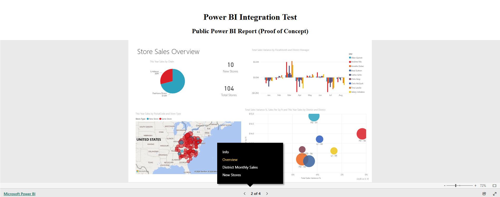

# Power BI Embedding Solutions (.NET & Angular) 📊

A comprehensive proof-of-concept project demonstrating three distinct methods for embedding Power BI reports into a modern web application. This project uses an **Angular** frontend and an **ASP.NET Core (.NET)** backend to showcase how to handle different authentication flows, licensing models, and security requirements.

## 📸 Dashboard Preview

## 🚀 Embedding Methods Implemented

### 1. Publish to Web (Public Method)
A straightforward approach for embedding non-sensitive public data.
* **Implementation:** Uses a standalone Angular component (`public-report.component.ts`) that securely renders an `<iframe>` using Angular's `DomSanitizer`.
* **Security & Considerations:** * ⚠️ **No Authentication:** The report is fully public.
  * ⚠️ **Data Exposure:** Anyone with the link can view the data. Should never be used for proprietary or confidential data.
  * ⚠️ **Search Indexing:** Microsoft may index these reports, making them discoverable in public search results.

### 2. Embed for Organization (User Owns Data)
A secure embedding method designed for internal users within the same tenant.
* **Implementation:** * **Azure AD Setup:** Registered the application in Microsoft Entra ID with "Power BI Service" delegated permissions.
  * **Frontend:** Utilized `powerbi-client-angular` and Microsoft Authentication Library (MSAL) to handle secure user login and token acquisition.
  * **API Communication:** Configured an HTTP Interceptor to automatically attach the user's Access Token to backend requests.
  * **Component:** `OrgReportComponent` fetches the embedding config from the .NET backend.
* **Requirements:** Requires the user logging in to have a valid Power BI Pro license.

### 3. Power BI Embedded (App Owns Data)
The professional, enterprise-grade embedding solution ideal for external users, customers, and partners.
* **Implementation:**
  * **Backend (.NET API):** Implemented `PowerBIService.cs` to authenticate as a Service Principal and fetch an **Embed Token** via the Power BI REST API. Exposes this via a secure controller endpoint.
  * **Frontend:** `embedded-report.component.ts` uses RxJS to fetch the token from the backend, then leverages the Power BI JavaScript SDK to render the report seamlessly.
* **Benefits:**
  * ✅ **No User Licenses Required:** Only the Service Principal needs access.
  * ✅ **Seamless Experience:** No user sign-in required for the Power BI frame.
  * ✅ **Full Control:** The application logic decides who sees what data.
  * ✅ **External User Friendly:** Works perfectly for B2B or B2C scenarios.

## 🛠️ Technologies Used

### Frontend
* **Framework:** Angular
* **Libraries:** `powerbi-client-angular`, MSAL (Microsoft Authentication Library), RxJS
* **Security:** `DomSanitizer`, HTTP Interceptors

### Backend
* **Framework:** ASP.NET Core Web API
* **Language:** C#
* **Integration:** Power BI REST API, Azure Active Directory (Entra ID) Service Principals

## 📦 Getting Started

*(Add instructions here on how to run the .NET backend and Angular frontend, e.g., `dotnet run` and `npm start`, along with any necessary Azure/PowerBI environment variables that need to be configured).*

## 📬 Contact

If you have questions about these embedding strategies or the code implementation, feel free to reach out:

* **Email:** [mariusc0023@gmail.com](mailto:mariusc0023@gmail.com)
